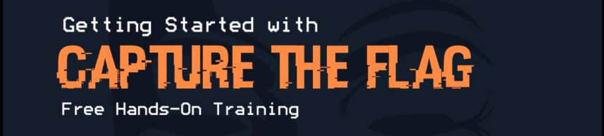

## CTF_Academy




### Как запускать таски
Предварительно установите Docker и Docker Compose.

- Запуск:
```bash
cd web-security-<lab-n>/tasks/<task>/compose
docker compose up -d
```
- Открыть в браузере: http://localhost:<порт_из_таблицы>
- Остановка таски и очистка артефактов (освобождение портов, удаление volume):
```bash
docker compose down -v
```

### Модуль WSL1: Уязвимости PHP Injection

Этот модуль посвящен изучению уязвимостей в PHP веб-приложениях. Здесь вы научитесь находить и эксплуатировать наиболее распространенные уязвимости в PHP коде.

**[Теория и описание уязвимостей PHP Injection](web-security-lab1/learning/PHP_Injection.md)**

**Таски:**

| Модуль            | Уязвимость            | Задача            | Уровень | Порты        | Задание | Райтап |
| ----------------- | --------------------- | ----------------- | ------- | ------------ | ------- | ------ |
| web-security-lab1 | PHP Injection         | php_easy_include  | Лёгкий  | 20011 <=> 80   | ссылка  | ссылка |
| web-security-lab1 | PHP Injection + Upload| php_load_image    | Лёгкий  | 20012 <=> 80   | ссылка  | ссылка |
| web-security-lab1 | PHP Injection + Upload| php_medium        | Средний | 20013 <=> 80   | ссылка  | ссылка |

### Модуль WSL2: Уязвимости XSS Injection

Этот модуль посвящён клиент‑серверным уязвимостям XSS (Cross‑Site Scripting).

Теория и описание уязвимостей PHP Injection (в процессе)

**Таски:**

| Модуль            | Уязвимость | Задача | Уровень | Порты        | Задание | Райтап |
| ----------------- | ---------- | ------ | ------- | ------------ | ------- | ------ |
| web-security-lab2 | XSS        |        |         | 200xx <=> 80   | ссылка  | ссылка |
| web-security-lab2 | XSS        |        |         | 200xx <=> 80   | ссылка  | ссылка |
| web-security-lab2 | XSS        |        |         | 200xx <=> 80   | ссылка  | ссылка |
